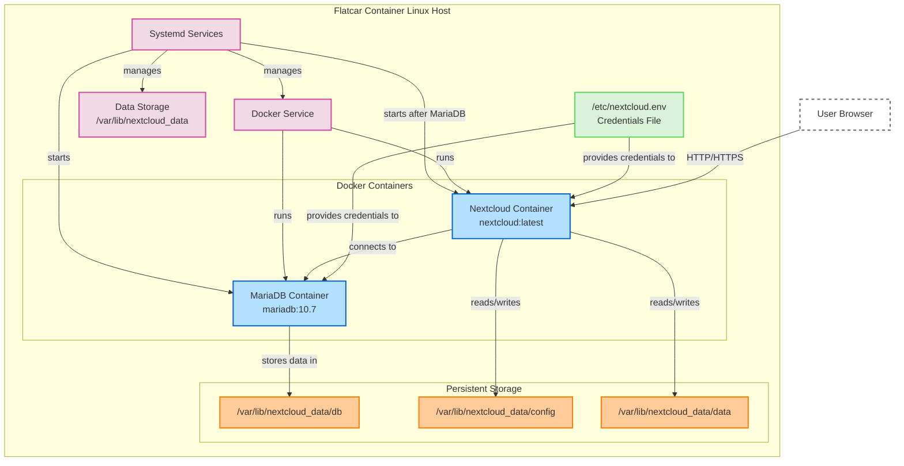

# Nextcloud on Flatcar Container Linux

This repository contains Butane configurations to deploy Nextcloud and MariaDB on Flatcar Container Linux. The configuration sets up:

1. A data storage location for Nextcloud data
2. Secure environment configuration for credentials
3. Systemd units for running MariaDB and Nextcloud containers

## Configuration Options

This repository provides three different Butane configuration files to accommodate different deployment scenarios:

### 1. Simple Configuration (`nextcloud-simple.yaml`)

The simplest setup that uses directories on the root filesystem. Best for:
- Testing environments
- Systems with limited disk options
- Quick deployments where data persistence isn't critical

**Features:**
- Uses a directory on the root filesystem for data
- No additional disk partitioning required
- Easiest to set up and use

### 2. Dedicated Partition (`nextcloud-dedicated.yaml`)

Uses a dedicated labeled partition for data storage. Best for:
- Production environments
- Systems with multiple disks
- Deployments where data persistence is important

**Features:**
- Stores all data on a separate partition labeled `NC_DATA`
- Better isolation between OS and data
- Easier backup and recovery options

### 3. Cloud-Optimized (`nextcloud-cloud.yaml`)

Automatically detects and configures additional disks in cloud environments. Best for:
- Deployments in AWS, GCP, Azure, or other cloud providers
- Systems where disk configuration happens after boot

**Features:** 
- Auto-detects additional attached disks
- Automatically formats and mounts disks as needed
- Falls back to root filesystem if no additional disk is found
- Works well with cloud-provider volume attachments

## Architecture Overview



## Usage Instructions

### 1. Choose your Configuration

Select the appropriate configuration file based on your needs:

- `nextcloud-simple.yaml`: Simplest setup using the root filesystem
- `nextcloud-dedicated.yaml`: Using a dedicated partition
- `nextcloud-cloud.yaml`: Auto-detecting disks in cloud environments

### 2. Prepare Storage (for dedicated partition only)

If using the dedicated partition configuration, ensure you have a partition labeled as `NC_DATA`:

```
sudo mkfs.ext4 -L NC_DATA /dev/sdX
```

where `/dev/sdX` is the device name of your additional volume.

### 3. Convert Butane to Ignition

Ignition is the configuration system used by Flatcar Container Linux. Convert your chosen Butane YAML to Ignition JSON:

1. Install the Butane tool:
   ```
   wget https://github.com/coreos/butane/releases/download/v0.17.0/butane-x86_64-unknown-linux-gnu
   mv butane-x86_64-unknown-linux-gnu butane
   chmod +x butane
   ```

2. Convert the configuration (replace with your chosen config file):
   ```
   ./butane --pretty --strict nextcloud-simple.yaml > nextcloud.ign
   ```

### 4. Boot Flatcar with Ignition Config

#### For Local/Physical Hardware

If deploying to physical hardware or a local VM:

1. Download the Flatcar ISO
2. Boot with the ISO and pass the Ignition config:
   ```
   flatcar.first_boot=1 flatcar.oem.id=qemu ignition.config.url=http://example.com/nextcloud.ign
   ```

#### For Cloud Providers

For cloud environments (AWS, GCP, Azure, etc.), consult the provider-specific documentation for passing Ignition configs. For example:

- **AWS**: Use user-data to pass the Ignition JSON
- **GCP**: Use custom metadata to provide the Ignition config

### 5. Access Nextcloud

Once your system is up and running:

1. Access Nextcloud via http://YOUR_SERVER_IP
2. Log in with the admin credentials set in `/etc/nextcloud.env`:
   - Username: `admin`
   - Password: `changeme_nextcloud_admin_password` (you should have changed this in the config)

### 5. Further Configuration

#### Add SSL/TLS

For production use, add SSL/TLS using either:

1. **Caddy or Traefik**: Deploy an additional container with automatic Let's Encrypt certificate management
2. **Manual configuration**: Set up a reverse proxy with SSL termination

Example Caddy container service that you could add to your Butane configuration:

```yaml
- name: caddy-container.service
  enabled: true
  contents: |
    [Unit]
    Description=Caddy Reverse Proxy with Automatic HTTPS
    After=nextcloud-container.service
    Requires=nextcloud-container.service
    
    [Service]
    TimeoutStartSec=0
    Restart=always
    ExecStartPre=-/usr/bin/docker stop %n
    ExecStartPre=-/usr/bin/docker rm %n
    ExecStartPre=/usr/bin/docker pull caddy:2
    ExecStart=/usr/bin/docker run --rm --name %n \
      --volume /var/lib/nextcloud_data/caddy_data:/data \
      --volume /var/lib/nextcloud_data/caddy_config:/config \
      --volume /var/lib/nextcloud_data/Caddyfile:/etc/caddy/Caddyfile:ro \
      --publish 80:80 \
      --publish 443:443 \
      caddy:2
    
    [Install]
    WantedBy=multi-user.target
```

Create a Caddyfile at `/var/lib/nextcloud_data/Caddyfile`:

```
your.domain.com {
  reverse_proxy localhost:80
}
```

#### Change Database Configuration

To use a different database or update the configuration:

1. Edit `/etc/nextcloud.env` with new database settings
2. Restart the containers:
   ```
   sudo systemctl restart mariadb-container.service nextcloud-container.service
   ```

#### External Database

To use an external database instead of the container:

1. Modify `/etc/nextcloud.env` to point to the external database
2. Disable the MariaDB container:
   ```
   sudo systemctl disable --now mariadb-container.service
   ```
3. Edit `nextcloud-container.service` to remove the dependency on `mariadb-container.service`

## Security Considerations

1. **Change all default passwords** in `/etc/nextcloud.env`
2. Implement SSL/TLS for secure connections
3. Consider network isolation for the database container
4. Regularly back up the `/var/lib/nextcloud_data` directory

## Maintenance

### Updates

To update the containers:

```
sudo systemctl restart mariadb-container.service nextcloud-container.service
```

The restart process will pull the latest images if available.

### Backups

Regularly back up the `/var/lib/nextcloud_data` directory to ensure data persistence.

Example backup script:

```bash
#!/bin/bash
BACKUP_DATE=$(date +%Y%m%d)
BACKUP_DIR=/backups
mkdir -p $BACKUP_DIR
tar -czf $BACKUP_DIR/nextcloud_backup_$BACKUP_DATE.tar.gz /var/lib/nextcloud_data
```